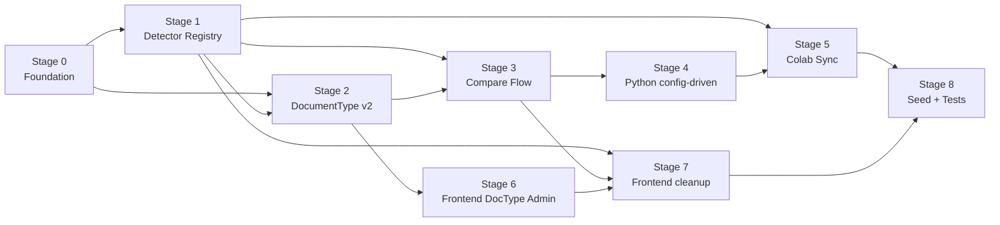

# Multi-Document Conversion — Stage Index

This folder breaks the high-level [MULTI_DOCUMENT_CONVERSION_PLAN.md](../MULTI_DOCUMENT_CONVERSION_PLAN.md) into nine ordered, junior-developer-friendly stage files. Each stage is small enough to be one PR and self-contained enough that a developer who is new to this project can complete it after reading **this README + the stage file + the few files referenced inside it**.

## What this project is (in 60 seconds)

We have a three-tier system that compares three approaches (classical OCR, VLM, hybrid) for extracting structured data from receipt images:

- **React** ([react/](../react)) — Ant Design UI, Redux Toolkit. The user uploads an image on `ComparePage` and sees three side-by-side result columns.
- **Node API** ([api/](../api)) — Express + TypeORM + PostgreSQL. Stores `DocumentType`, `Model`, `ComparisonRun`, `Benchmark`, `User`. Exposes `POST /api/compare` which proxies to the Python service.
- **Python compare service** — FastAPI in [colab_app2.ipynb](../colab_app2.ipynb), running on **Google Colab**. Does the actual ML work (YOLO + Qwen-VL).

The whole thing is currently hard-coded for one document type (Russian receipts) with one fixed YOLO `.pt` and one fixed schema. **Our goal:** turn it into a multi-document platform where an admin can register a new document type, upload its detector model, define its schema, and run/compare immediately.

## Important deployment fact

The Python service runs on **Google Colab**, not on the same machine as the Node API. Colab loses files in `/content/` on session restart. So we cannot share a disk; we must **transfer `.pt` files from Node to Colab over HTTP** with a sync mechanism. This is a major architectural difference from the original markdown plan and drives Stage 5.

For Colab to reach the Node API you must run a tunnel (e.g. ngrok, cloudflared) and put the public URL in `PUBLIC_API_URL` (Node config) and `NODE_API_URL` (Colab cell). Colab cannot reach `http://localhost:3000`.

## Stage order

| # | File | Scope | Depends on |
|---|------|-------|------------|
| 0 | [STAGE_00_foundation.md](./STAGE_00_foundation.md) | New config keys, sync-token middleware, conventions, `synchronize: true` understanding | — |
| 1 | [STAGE_01_detector_registry.md](./STAGE_01_detector_registry.md) | `Model` entity v2, lifecycle endpoints, `.pt` validation, sha256, fix `/file` route | 0 |
| 2 | [STAGE_02_document_type_v2.md](./STAGE_02_document_type_v2.md) | `DocumentType` entity v2, CRUD v2, activate, attach detector, version bump | 0, 1 |
| 3 | [STAGE_03_compare_flow_backend.md](./STAGE_03_compare_flow_backend.md) | `compareController` sends new payload to Python; `ComparisonRun` snapshot fields | 1, 2 |
| 4 | [STAGE_04_python_config_driven.md](./STAGE_04_python_config_driven.md) | `colab_app2.ipynb` becomes config-driven (drop hard-coded labels/paths/prompts) | 3 |
| 5 | [STAGE_05_colab_model_sync.md](./STAGE_05_colab_model_sync.md) | Node sync endpoints + Colab boot-pull + per-request fallback + sha256 verify | 1, 4 |
| 6 | [STAGE_06_frontend_doctype_admin.md](./STAGE_06_frontend_doctype_admin.md) | New `/document-types` page + 5-step wizard + full CRUD slice | 2 |
| 7 | [STAGE_07_frontend_models_compare_runs.md](./STAGE_07_frontend_models_compare_runs.md) | `ModelsPage` registry view, `ComparePage` cleanup, `RunsPage`/`RunDetailPage` snapshot fields | 1, 3, 6 |
| 8 | [STAGE_08_seed_and_tests.md](./STAGE_08_seed_and_tests.md) | Migrate receipts as first seeded `DocumentType`, regression tests, sync tests | 1–7 |

Stages can roughly be done in parallel pairs once their dependencies are met:

## Conventions for every stage

- **Read before writing.** Each stage begins with a "Files to read first" list. Read those before opening your editor.
- **One PR per stage** is the recommended granularity. Title the PR `Stage N: <short title>`.
- **Schema sync.** TypeORM is configured with `synchronize: true` in [api/config/default.json](../api/config/default.json) (line 19). That means when you add a column to a `@Entity` class and restart the API, the DB column appears automatically. **Do not** write SQL migrations.
- **Single source of truth for config.** [api/config/default.json](../api/config/default.json) is loaded directly with `import config from "../../config/default.json"`. The codebase does **not** use `process.env` outside `dotenv/config`. Add new config keys here.
- **No emojis** in code or comments unless explicitly asked.
- **Comments policy.** Only comments that explain non-obvious intent, trade-offs, or constraints. No "// import the module" style comments.
- **Linter.** ESLint + Prettier are configured. Run `yarn lint` and `yarn build` (or whatever scripts exist in the relevant `package.json`) before opening the PR.
- **Receipt is just one document type.** When you see `DATE`, `FB`, `FD`, `SUM`, `ORDER`, `NAME`, `PRICE`, `QUANTITY` in the seed, those are receipt-specific labels. Your job is to make sure they only live in the seed/config, never in the runtime code.

## Definition of "Done" for the whole project

- Admin can create a second document type (e.g. `invoice`) from the UI, upload its `.pt`, activate it, and run `/compare` for an invoice image — all without restarting the Node API and without editing the notebook.
- Existing receipt flow still works after migration.
- Each `ComparisonRun` row stores the document type version and detector model version it was made with.
- Colab can be restarted and recover all `.pt` files by running one sync cell.
- All tests pass (`api/yarn test`, manual end-to-end test plan in Stage 8).

## Where to ask for help

Each stage has a "Common pitfalls" section. If you hit something that's not covered there, leave a comment on the PR with `@reviewer` and link the line — do not silently work around it.
